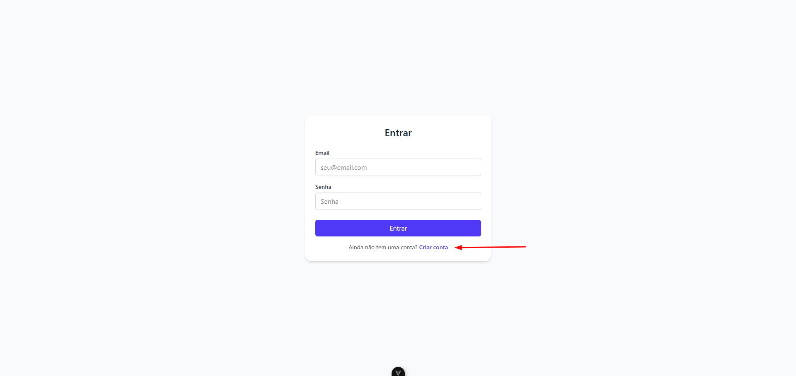
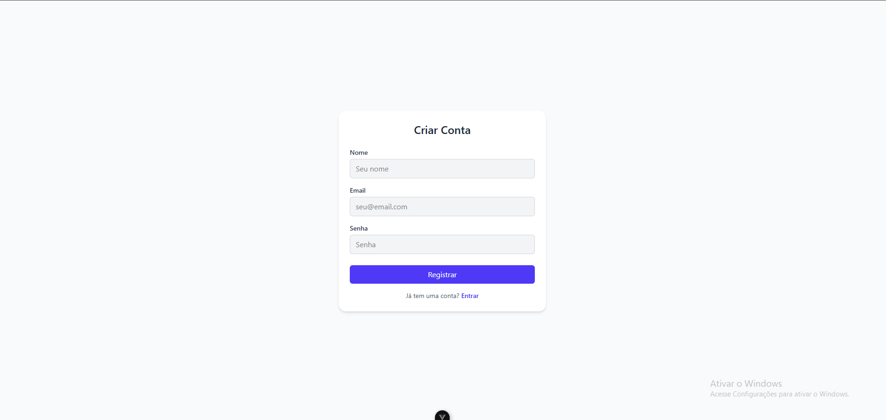
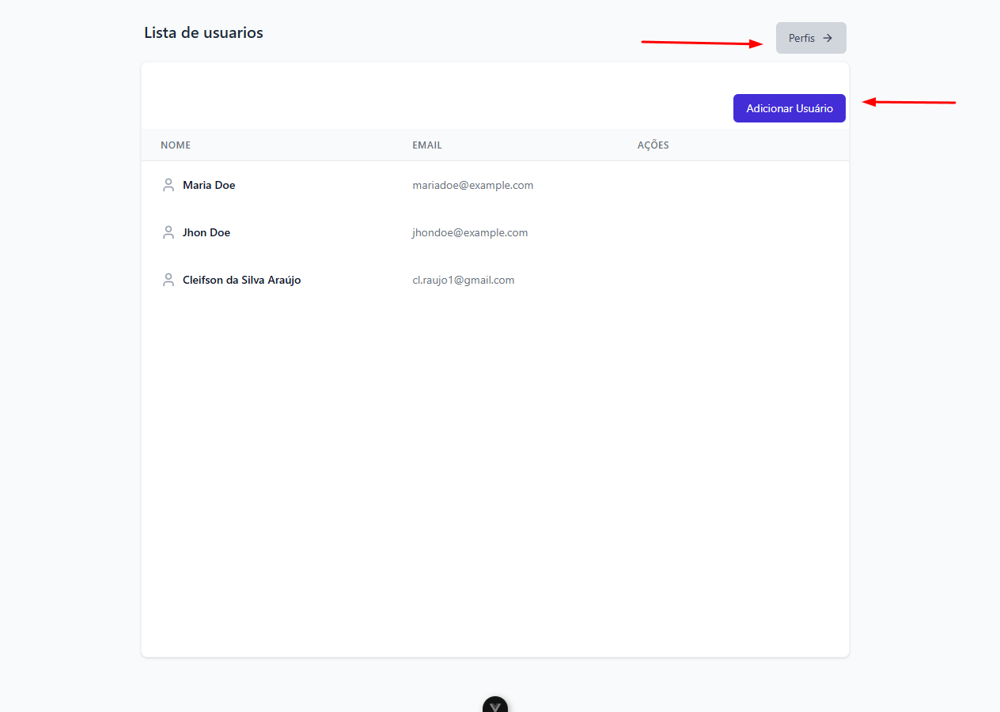
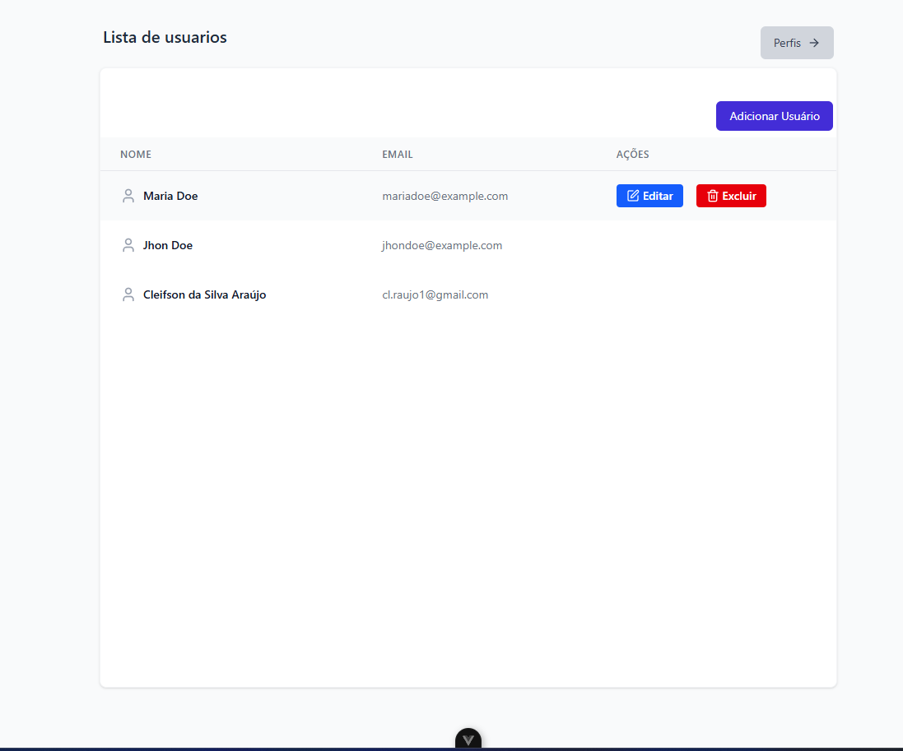
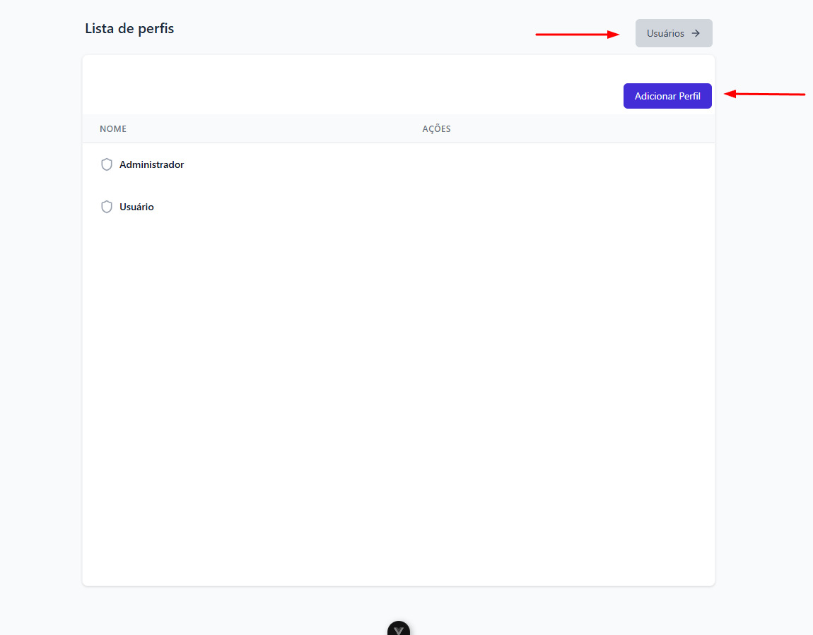
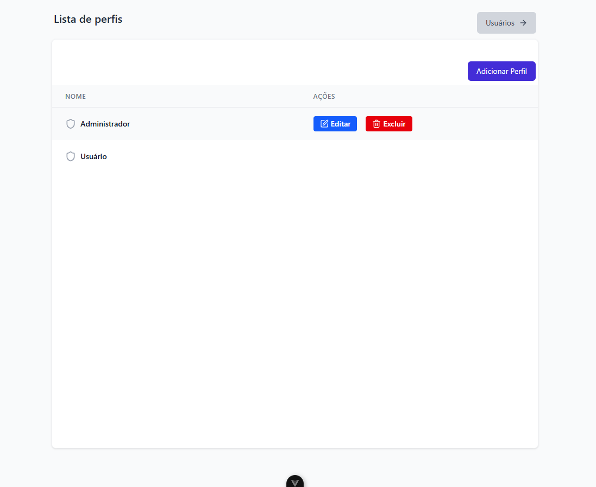

# conceituacao-teste

## Projeto Laravel + Vue

Este projeto utiliza Laravel no backend e Vue.js no frontend. A seguir, estão as instruções para rodar o projeto manualmente, mas recomendo o uso do script `setup.sh` e `migrate.sh` para automação do processo.

## Pré-requisitos

Antes de rodar o projeto, é necessário ter as seguintes ferramentas instaladas:

- [Docker](https://www.docker.com/get-started)
- [Docker Compose](https://docs.docker.com/compose/install/)

### Observações

- O script `setup.sh` e `migrate.sh` automatiza o processo de configuração e execução dos containers, tornando o processo mais simples e rápido. 

## Passo a Passo

### 1. Clonando o Repositório
Primeiro, clone o repositório para sua máquina local:

```bash
  git clone https://github.com/Cleyfson/conceituacao.git
  cd conceituacao
```

## 2. Execute o arquivo setup.sh e migrate.sh que está no root do projeto

```bash
./setup.sh
./migrate.sh
```

Caso você encontre problemas de permissão ao rodar os arquivos `.sh`, é possível que o script não tenha permissão de execução. Para corrigir isso, execute o comando abaixo antes de rodá-los:

```bash
chmod +x setup.sh
chmod +x migrate.sh
```

## Passo a Passo manual

### 1. Clonando o Repositório

Primeiro, clone o repositório para sua máquina local:

```bash
git clone https://github.com/Cleyfson/conceituacao.git
cd conceituacao
```

## 2. Configuração do Ambiente

### 2.1 Configuração da API (Backend)

Navegue até o diretório `api` e copie o .env-example:

```bash
cd api
cp .env.example .env
```

### 2.2 Configuração do Frontend
Navegue até o diretório `frontend` e copie o .env-example:

```bash
cd fronted
cp .env.example .env
```

## 3. Subindo os Containers

Execute o comando abaixo para iniciar os containers. O Docker irá construir as imagens e subir os containers em segundo plano:

```bash
docker-compose up --build -d
```

Isso vai iniciar os seguintes containers:

Backend (laravel_app)
Frontend (vue_frontend)
Banco de Dados (laravel_db)
Webserver (laravel_webserver)

## 4. Configurando aplicação

Depois disso, execute os comandos abaixo para configurar a aplicação:

```bash
docker exec laravel_app php artisan key:generate
docker exec laravel_app php artisan jwt:secret
docker exec laravel_app php artisan migrate --seed
```

## 6. CRUD de User

A API foi construída seguindo os princípios de Domain-Driven Design (DDD), que organiza o projeto em camadas bem definidas com foco na separação de responsabilidades. A estrutura está centralizada no diretório api/app/, distribuída principalmente entre as camadas:

| Diretório | Descrição |
| --- | --- |
| Domain/Services/ | Contém as logicas de negocios da aplicação, separados por domínio (Auth, User, etc).
| Domain/Entities/ | Entidades do domínio com as regras fundamentais de negócio. Por exemplo, Profile, User, etc. |
| Domain/Contracts/ | Interfaces que descrevem como o domínio interage com fontes de dados. |
| Infra/Persistence/ | Implementações concretas dos repositórios definidos em Domain/Contracts/. |
| Http/Controllers/ | Camada de controle das requisições HTTP. Recebe a requisição, chama o service apropriado e retorna uma resposta. |
| Http/Requests/ | Validações centralizadas de entrada para as requisições da API. |
| routes/api.php | Define as rotas expostas pela API e os controladores responsáveis. |

O fluxo de User está implementado dentro do contexto de DDD, com as responsabilidades divididas entre as camadas Domain e Infra.

| Diretório | Descrição |
| --- | --- |
| Service | App\Domains\User\Services\UserService |
| Controller | App\Http\Controllers\UserController.php.php |
| Requests | App\Http\Requests\User |
| Entidade | App\Domains\User\Entities\User.php |
| Repositório (Interface) | App\Domains\User\Contracts\UserRepositoryInterface.php |
| Repositório (Implementação) | App\Infrastructure\Persistence\User\EloquentUserRepository.php |
| Frontend | frontend/src/views/UserView.vue e componentes em frontend/src/components/user |

O fluxo de Profile está implementado dentro do contexto de DDD, com as responsabilidades divididas entre as camadas Domain e Infra.

| Diretório | Descrição |
| --- | --- |
| Service | App\Domains\Profile\Services\ProfileService |
| Controller | App\Http\Controllers\ProfileController.php.php |
| Requests | App\Http\Requests\Profile |
| Entidade | App\Domains\Profile\Entities\Profile.php |
| Repositório (Interface) | App\Domains\Profile\Contracts\ProfileRepositoryInterface.php |
| Repositório (Implementação) | App\Infrastructure\Persistence\Profile\EloquentProfileRepository.php |
| Frontend | frontend/src/views/ProfileView.vue e componentes em frontend/src/components/profile |

## 7. Como testar a aplicação

Após subir os containers e executar as migrações, você pode acessar a aplicação nos seguintes endereços:

Backend (Laravel): http://localhost:8000

Frontend (Vue.js): http://localhost:5173

## Testar via Postman

[](https://app.getpostman.com/run-collection/26530639-ac71833c-0986-4236-a0f5-ee3b1e64d699?action=collection%2Ffork&source=rip_markdown&collection-url=entityId%3D26530639-ac71833c-0986-4236-a0f5-ee3b1e64d699%26entityType%3Dcollection%26workspaceId%3D7cec8dfb-7f5e-4996-ab16-640e76e7c59a)

## Testes automatizados

Para rodar os testes automatizados execute o seguinte comando no root do projeto
```bash
docker exec laravel_app php artisan test
docker exec vue_frontend npm run test:unit
```

## Interface da Aplicação

Ao acessar a aplicação em http://localhost:5173, você será direcionado para a tela de login.

Um usuário de teste já foi criado com perfil admin:

**Email:** test@example.com  
**Senha:** password

Caso deseje, é possível criar um novo usuário clicando em "Criar uma nova conta" na tela de login.

| Tela de Login | Tela de Registro |
|---------------|------------------|
|  |  |

Após o login, você será redirecionado para a tela inicial de usuarios.

| Tela de usarios | Tela de usarios ações (hover) |
|---------------|------------------|
|  |  |

Para visualizar os perfils, clique em "perfis" na barra superior.

| Tela de perfis | Tela de perfis ações (hover) |
|---------------|------------------|
|  |  |


Usuários que não são administradores podem apenas visualizar a lista e os detalhes dos usuários. Eles não têm acesso à lista de perfis, nem podem editar, excluir ou criar usuários. Para testar essas funcionalidades, é necessário estar logado com um usuário administrador.